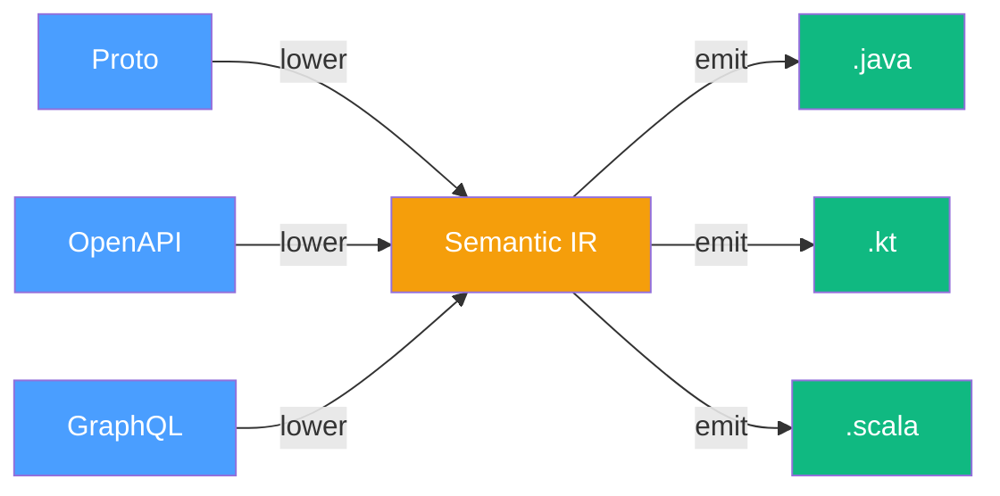

# IRCraft

MLIR-inspired IR framework for transforming domain schemas into multi-language code, written in Scala 3.

> Design background: [Compiler Ideas for Code Generation](https://alnovis.io/blog/compiler-ideas-for-code-generation)

## How It Works

IRCraft is a framework for **A -> Semantic -> B/C** transformations with optional intermediate effects (merge, enrichment):



| Concept | Role |
|---------|------|
| **Dialect** | Groups related Operations at one abstraction level |
| **Operation** | Immutable, content-addressable IR node (GreenNode) |
| **Pass** | Transforms a Module (IR tree) -- stateless, testable |
| **Pipeline** | Composes Passes -- fail-fast or collect-all modes |
| **Lowering** | A Pass that crosses dialect boundaries |
| **Emitter** | Converts Semantic IR to source code |

## Dialects

### Source Dialects (A -> Semantic)

| Dialect | Ops | Lowering |
|---------|-----|----------|
| **Proto** | ProtoFileOp, MessageOp, FieldOp, EnumOp, OneofOp | Message->Interface, Enum->EnumClass |
| **OpenAPI** | OpenApiSpecOp, SchemaObjectOp, OperationOp, ParameterOp, ... (21 ops) | Schema->Class, Operation->Method |
| **GraphQL** | GqlSchemaOp, ObjectTypeOp, InputObjectTypeOp, UnionTypeOp, ... (12 ops) | ObjectType->Interface, InputType->Class |

### Target Dialects (Semantic -> B)

| Dialect | Output |
|---------|--------|
| **Java** | `.java` files (JavaDoc, generics, boxing) |
| **Kotlin** | `.kt` files (nullable `T?`, companion objects, KDoc) |
| **Scala** | `.scala` files (traits, `Option[T]`, ScalaDoc) |

### Semantic IR (in core)

The shared OOP abstraction layer: `FileOp`, `ClassOp`, `InterfaceOp`, `MethodOp`, `EnumClassOp`, `FieldDeclOp`, `ConstructorOp`, `Expression`, `Statement`, `Block`.

## Modules

| Module | Description |
|--------|-------------|
| `ircraft-core` | IR framework + Semantic IR + Dialect Framework (`core.framework.*`) |
| `ircraft-dialect-proto` | Protobuf schema IR + lowering |
| `ircraft-dialect-openapi` | OpenAPI 3.0 spec IR + lowering |
| `ircraft-dialect-graphql` | GraphQL schema IR + lowering |
| `ircraft-dialect-java` | Java emitter + type mapping |
| `ircraft-dialect-kotlin` | Kotlin emitter + type mapping |
| `ircraft-dialect-scala` | Scala 3 emitter + type mapping |
| `ircraft-java-api` | Java-friendly facade (Ops, Expr, Types, IR) |

## Quick Start

### Proto -> Java

```scala
import io.alnovis.ircraft.core.*
import io.alnovis.ircraft.dialect.proto.ops.*
import io.alnovis.ircraft.dialect.proto.dsl.ProtoSchema
import io.alnovis.ircraft.dialect.proto.lowering.ProtoToSemanticLowering

// 1. Build Proto IR
val file = ProtoSchema.file("com.example", ProtoSyntax.Proto3) { f =>
  f.message("Money") { msg =>
    msg.field("amount", 1, TypeRef.LONG)
    msg.field("currency", 2, TypeRef.STRING)
    msg.repeatedField("tags", 3, TypeRef.STRING)
  }
  f.enum_("Currency") { e =>
    e.value("UNKNOWN", 0)
    e.value("USD", 1)
    e.value("EUR", 2)
  }
}

// 2. Lower to Semantic IR
val module = IrModule("my-api", Vector(file))
val result = ProtoToSemanticLowering.run(module, PassContext())
// result.module contains FileOps with InterfaceOp(Money) and EnumClassOp(Currency)
```

### OpenAPI -> Semantic

```scala
import io.alnovis.ircraft.dialect.openapi.dsl.OpenApiSchema
import io.alnovis.ircraft.dialect.openapi.ops.*
import io.alnovis.ircraft.dialect.openapi.lowering.OpenApiToSemanticLowering

val spec = OpenApiSchema.spec("Pet Store", "1.0.0") { s =>
  s.schema("Pet") { obj =>
    obj.property("id", TypeRef.LONG, required = true)
    obj.property("name", TypeRef.STRING, required = true)
    obj.property("status", TypeRef.STRING)
  }
  s.path("/pets") { path =>
    path.get("listPets") { op =>
      op.queryParam("limit", TypeRef.INT)
      op.response(200, "List of pets", schemaType = TypeRef.ListType(TypeRef.NamedType("Pet")))
    }
  }
}
```

### GraphQL -> Semantic

```scala
import io.alnovis.ircraft.dialect.graphql.dsl.GraphQlSchema
import io.alnovis.ircraft.dialect.graphql.ops.*

val schema = GraphQlSchema.schema("Query") { s =>
  s.objectType("User") { t =>
    t.field("id", TypeRef.NamedType("ID"))
    t.field("name", TypeRef.STRING)
    t.field("posts", TypeRef.ListType(TypeRef.NamedType("Post"))) { f =>
      f.argument("limit", TypeRef.INT, defaultValue = Some("10"))
    }
  }
  s.enumType("Role") { e =>
    e.value("ADMIN")
    e.value("USER")
  }
  s.unionType("SearchResult", members = List("User", "Post"))
}
```

### Three Ways to Create Dialects

```scala
// 1. Derived -- zero boilerplate, compile-time
case class Person(name: String, age: Int) derives IrcraftSchema

// 2. Generic -- quick start, ~6 lines
val D = GenericDialect("config"):
  leaf("entry", "key" -> StringField, "value" -> StringField)
  container("section", "name" -> StringField)("entries")

// 3. Typed -- production, full control
case class MessageOp(name: String, ...) extends Operation
```

See [Creating a Custom Dialect](docs/CUSTOM_DIALECT.md) for details.

### Dialect Framework (given/using, type classes)

```scala
import io.alnovis.ircraft.core.framework.*

// Name conversion via given
given NameConverter = NameConverter.snakeCase
NameConverter.snakeCase.getterName("user_name") // "getUserName"

// Generic enum building via type class
val protoEnum = SemanticBuilders.enumFrom(
  "Status",
  Vector(EnumValueMapper.IntValued("ACTIVE", 1), EnumValueMapper.IntValued("INACTIVE", 2))
)

// Generic interface building
val iface = SemanticBuilders.interfaceFrom(
  "Money",
  Vector("amount" -> TypeRef.LONG, "currency" -> TypeRef.STRING)
)

// Composable verifier
import VerifierDsl.*
def verify(msg: MessageOp): List[DiagnosticMessage] =
  nameNotEmpty(msg, msg.name) ++
  noDuplicates(msg.fields, _.number, "field number", s"in '${msg.name}'", msg.span)
```

## Project Structure

```
ircraft/
├── ircraft-core/                          # Core IR framework
│   └── src/main/scala/io/alnovis/ircraft/core/
│       ├── GreenNode.scala                # Immutable content-addressable node
│       ├── Operation.scala                # IR operation (extends GreenNode)
│       ├── IrModule.scala                 # Top-level IR container
│       ├── TypeRef.scala                  # Type system (10 variants)
│       ├── Dialect.scala                  # Dialect trait (default verify)
│       ├── Pass.scala                     # Pass, Lowering, Pipeline
│       ├── IrcraftSchema.scala            # derives IrcraftSchema
│       ├── GenericDialect.scala           # GenericDialect + GenericOp
│       ├── framework/                     # Dialect Framework
│       │   ├── NameConverter.scala        # given/using name conversion
│       │   ├── SemanticBuilders.scala     # interfaceFrom, classFrom, enumFrom
│       │   ├── EnumValueMapper.scala      # type class for enum lowering
│       │   ├── VerifierDsl.scala          # composable validators
│       │   ├── LoweringHelper.scala       # abstract base for lowerings
│       │   ├── SourceDialect.scala        # mixin: A -> Semantic
│       │   └── TargetDialect.scala        # mixin: Semantic -> B
│       └── semantic/                      # Semantic IR (the platform)
│           ├── SemanticDialect.scala
│           ├── ops/                       # ClassOp, InterfaceOp, MethodOp, ...
│           ├── expr/                      # Expression, Statement, Block
│           └── emit/                      # BaseEmitter
│
├── dialects/
│   ├── proto/                             # Protobuf (6 ops + lowering)
│   ├── openapi/                           # OpenAPI 3.0 (21 ops + lowering)
│   ├── graphql/                           # GraphQL (12 ops + lowering)
│   ├── java/                              # Java emitter
│   ├── kotlin/                            # Kotlin emitter
│   └── scala/                             # Scala 3 emitter
│
├── ircraft-java-api/                      # Java-friendly facade
├── examples/                              # Example dialects
├── docs/
│   ├── ARCHITECTURE.md
│   ├── CUSTOM_DIALECT.md
│   ├── JAVA_FACADE_API.md
│   └── EMIT_BASED_LOWERING.md
└── build.sbt
```

## Roadmap

| Phase | Status | Description |
|-------|--------|-------------|
| 1 | Done | ircraft-core (GreenNode, TypeRef, Pass, Pipeline) |
| 2 | Done | Semantic IR in core (ClassOp, InterfaceOp, Expression AST) |
| 3 | Done | Java, Kotlin, Scala emitters |
| 4 | Done | Java facade API |
| 5 | Done | Generic Dialect + Derived schemas |
| 6 | Done | Proto Dialect (simple, no versioning) + lowering |
| 7 | Done | OpenAPI Dialect (full) + lowering |
| 8 | Done | GraphQL Dialect (full) + lowering |
| 9 | Done | Dialect Framework (NameConverter, SemanticBuilders, VerifierDsl) |
| 10 | Planned | IR serialization (textual + JSON) |
| 11 | Planned | Red Tree (parent refs, LSP support) |

## Tech Stack

- **Scala 3.6.4** -- case classes, sealed traits, enums, given/using, type classes, extension methods
- **sbt 1.10** -- build tool
- **MUnit** -- test framework
- **Zero external dependencies** (only Scala stdlib)

## License

Apache License 2.0
