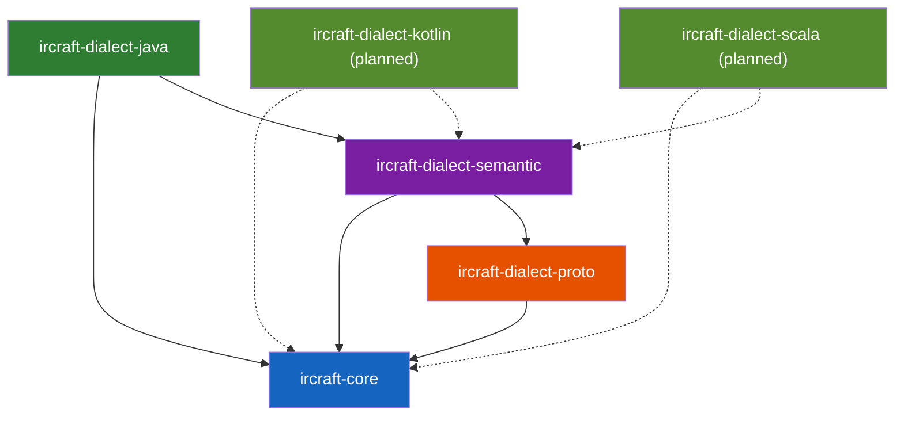
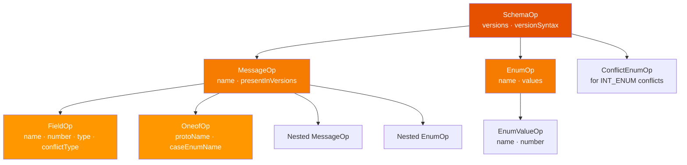
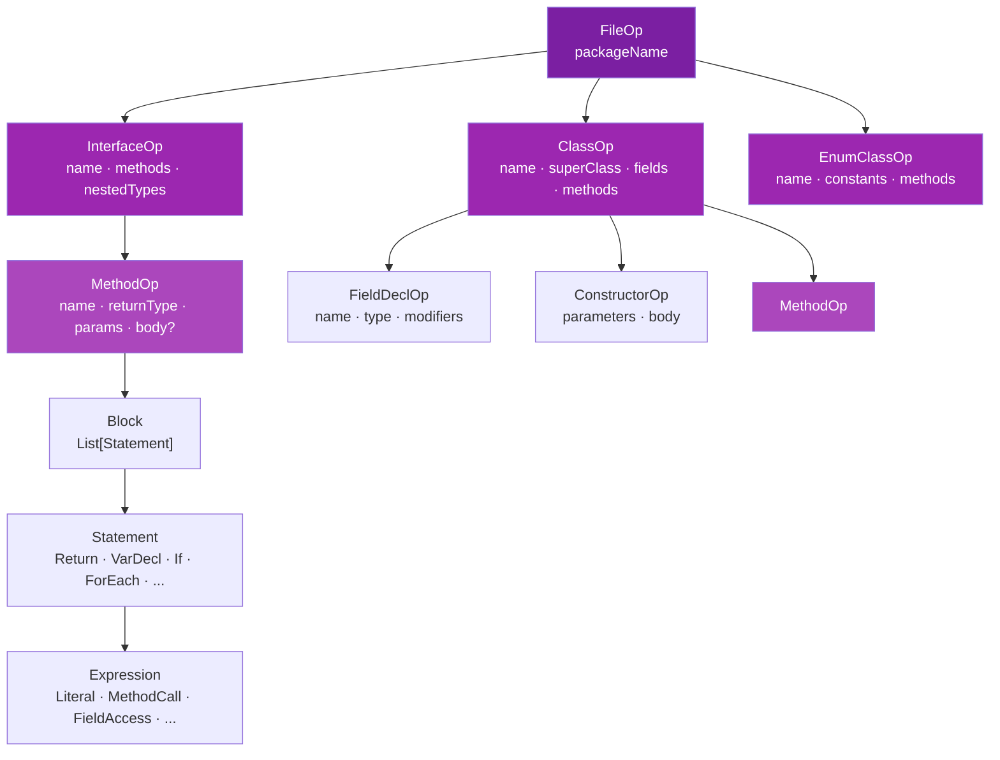
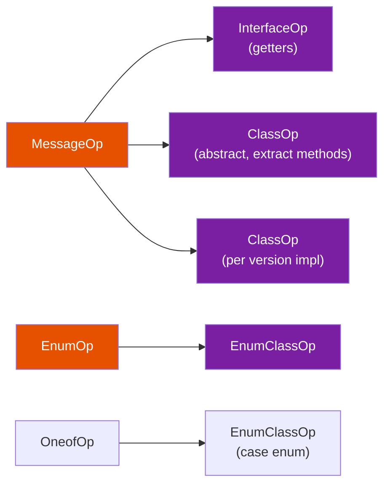
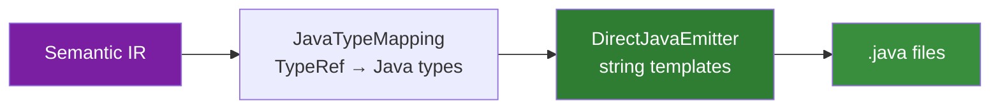
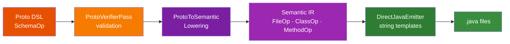
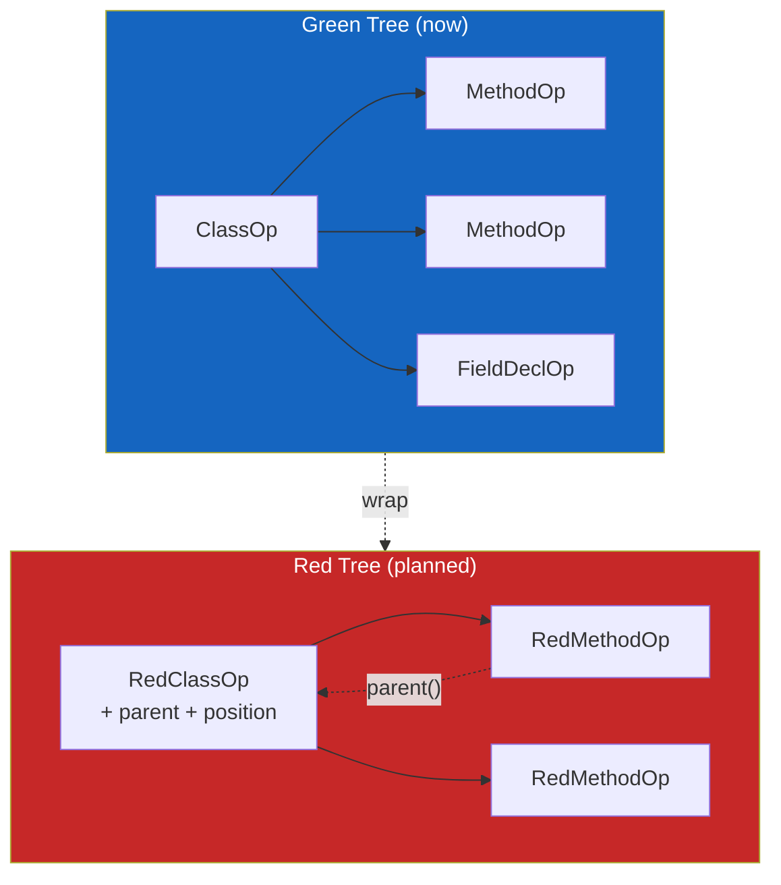

# Architecture

> The ideas behind IRCraft's architecture — MLIR dialects, Nanopass pipelines, and Red-Green Trees — are explored in detail in [Compiler Ideas for Code Generation](https://alnovis.io/blog/compiler-ideas-for-code-generation).

## Module Dependency Graph



## Core Framework

ircraft-core provides the foundation — all other modules depend only on it.

```mermaid
flowchart TB
    subgraph IR["IR Nodes"]
        GN["GreenNode\nimmutable · content hash · width"]
        OP["Operation\nextends GreenNode · kind · attrs · regions"]
        MOD["Module\ntop-level container"]
        REG["Region\nnamed block of Operations"]
    end

    subgraph Identity["Identity & Metadata"]
        NID["NodeId\nopaque type over Int"]
        CH["ContentHash\nMurmurHash3 mixing"]
        ATTR["Attribute\nsealed trait · typed key-value"]
        AMAP["AttributeMap\nimmutable collection"]
        SPAN["Span\nfile · line · col · length"]
    end

    subgraph Types["Type System"]
        TR["TypeRef — sealed trait"]
        PRIM["PrimitiveType\nInt32 · Int64 · Float · Bool · String · Bytes"]
        NAMED["NamedType · ListType · MapType\nOptionalType · EnumType · UnionType"]
        MOD2["Modifier\nenum: Public · Private · Abstract · Final · ..."]
    end

    subgraph Framework["Dialect & Pass Framework"]
        DI["Dialect\nnamespace · operationKinds · verify"]
        PA["Pass\nname · run(Module) → PassResult"]
        LO["Lowering\nextends Pass · sourceDialect → targetDialect"]
        PI["Pipeline\ncomposition · fail-fast · diagnostics"]
        DIAG["DiagnosticMessage\nSeverity: Info · Warning · Error"]
    end

    subgraph Emit["Emission"]
        EM["Emitter\ntrait: emit(Module) → Map[path, source]"]
        EU["EmitterUtils\nindent · block · wrapComment"]
    end

    GN --> OP --> MOD
    OP --> REG
    CH --> NID
    ATTR --> AMAP
    TR --> PRIM
    TR --> NAMED
    DI --> PA --> PI
    PA --> LO
    EM --> EU

    style IR fill:#1565c0,color:#fff
    style Identity fill:#0277bd,color:#fff
    style Types fill:#01579b,color:#fff
    style Framework fill:#1565c0,color:#fff
    style Emit fill:#0288d1,color:#fff
```



## Proto Dialect

High-level protobuf schema representation. Maps directly to proto-wrapper-plugin's `MergedSchema` model.



### ConflictType

When a field changes type between proto versions, a ConflictType is assigned:

| ConflictType | Example | Resolution |
|---|---|---|
| `None` | Same type in all versions | Direct access |
| `IntEnum` | `int32` ↔ `enum` | Dual getters: int + enum helper |
| `Widening` | `int32` → `int64` | Wider type (long) |
| `FloatDouble` | `float` → `double` | Wider type (double) |
| `StringBytes` | `string` ↔ `bytes` | Manual conversion |
| `SignedUnsigned` | `int32` ↔ `uint32` | Long for safety |
| `RepeatedSingle` | singular ↔ repeated | List |
| `PrimitiveMessage` | `int32` ↔ `Money` | Dual accessors |
| `Incompatible` | Fundamentally different | Error |

### Proto DSL

```scala
val schema = ProtoSchema.build("v1", "v2") { s =>
  s.message("Money") { m =>
    m.field("amount", 1, TypeRef.LONG)
    m.field("currency", 2, TypeRef.STRING)
  }
  s.enum_("Currency") { e =>
    e.value("USD", 0)
    e.value("EUR", 1)
  }
}
```

## Semantic Dialect

Language-agnostic OOP constructs. This is the shared layer — Java, Kotlin, and Scala dialects all lower from here.



### Proto → Semantic Lowering

The key transformation — encodes the generation strategy:



| Proto | → Semantic |
|-------|-----------|
| `MessageOp` | `InterfaceOp` + `ClassOp`(abstract) + `ClassOp`(impl per version) |
| `FieldOp` | `MethodOp`(getter) + `FieldDeclOp` + `MethodOp`(extract) |
| `EnumOp` | `EnumClassOp` |
| `OneofOp` | `EnumClassOp`(case enum) + `MethodOp`(discriminator) |

## Java Dialect

Emits Java source code from Semantic IR. No external dependencies (no JavaPoet).



### Type Mapping

| TypeRef | Java Type | Boxed |
|---------|-----------|-------|
| `Int32` | `int` | `Integer` |
| `Int64` | `long` | `Long` |
| `Float32` | `float` | `Float` |
| `Float64` | `double` | `Double` |
| `Bool` | `boolean` | `Boolean` |
| `StringType` | `String` | `String` |
| `Bytes` | `byte[]` | `byte[]` |
| `ListType(T)` | `List<T>` | — |
| `MapType(K,V)` | `Map<K,V>` | — |

## End-to-End Pipeline



## GreenNode Properties

All IR nodes are GreenNodes — the "Green" part of Red-Green Trees (Roslyn):

| Property | Description |
|----------|-------------|
| **Immutable** | Case classes, no mutation after construction |
| **Content-addressable** | `contentHash` derived from content, not identity |
| **No parent refs** | Top-down navigation only (parent refs added later via Red Tree) |
| **Relative width** | For future absolute position computation in Red Tree |



## Extending IRCraft

### Custom Dialect

```scala
object MyDialect extends Dialect:
  val namespace = "my"
  val description = "My custom dialect"

  object Kinds:
    val Widget = NodeKind(namespace, "widget")

  val operationKinds = Set(Kinds.Widget)

  def verify(op: Operation) =
    if !owns(op) then List(DiagnosticMessage.error("Not my op"))
    else Nil

case class WidgetOp(
    name: String,
    attributes: AttributeMap = AttributeMap.empty,
    span: Option[Span] = None,
) extends Operation:
  val kind = MyDialect.Kinds.Widget
  val regions = Vector.empty
  lazy val contentHash = ContentHash.ofString(name)
  val width = 1
```

### Custom Pass

```scala
object MyTransformPass extends Pass:
  val name = "my-transform"
  val description = "Transforms widgets"

  def run(module: Module, context: PassContext) =
    val transformed = module.topLevel.map:
      case w: WidgetOp => w.copy(name = w.name.toUpperCase)
      case other => other
    PassResult(module.copy(topLevel = transformed))
```

### Custom Pipeline

```scala
val pipeline = Pipeline("my-pipeline",
  MyTransformPass,
  ProtoVerifierPass,
  ProtoToSemanticLowering(config),
)
val result = pipeline.run(module, PassContext())
```
