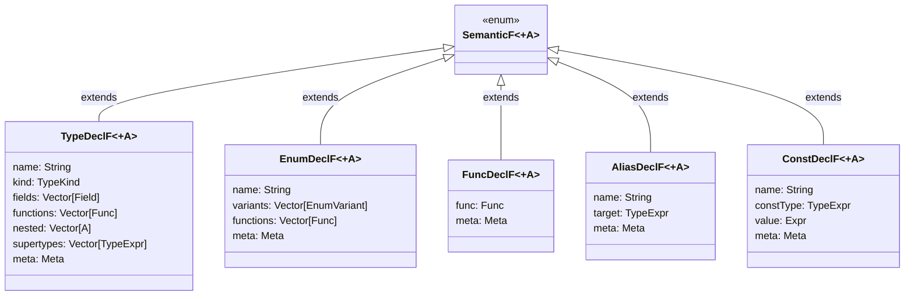
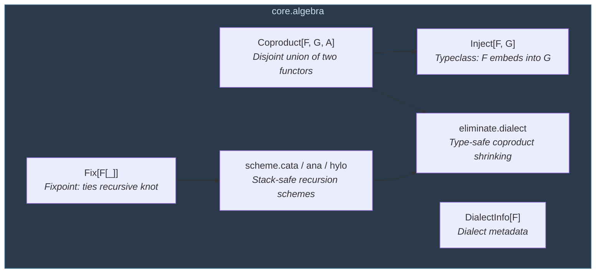
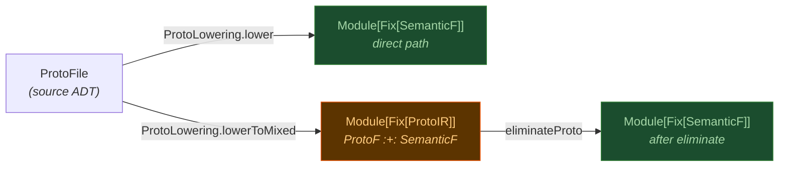
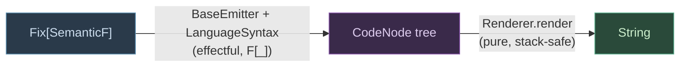
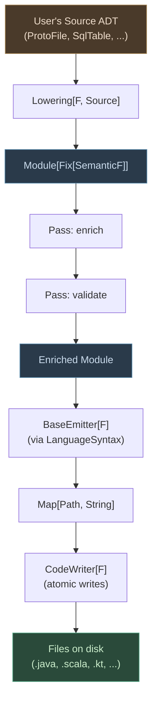
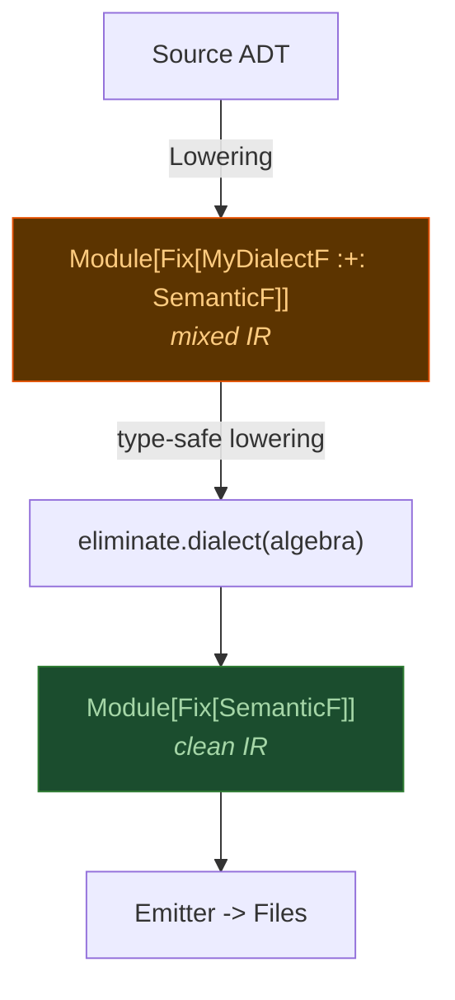

# Architecture

> The ideas behind ircraft's architecture are explored in [Compiler Ideas for Code Generation](https://alnovis.io/blog/compiler-ideas-for-code-generation).

## Core Idea

ircraft is a **framework for building code generators**, not a code generator itself.

```
A -> X -> B
```

- **A** -- source model (proto schema, OpenAPI spec, SQL DDL, any user DSL)
- **X** -- language-agnostic intermediate representation (Semantic IR)
- **B** -- target code (Java, Scala, Kotlin, TypeScript, Go, ...)

Users inject **passes** at stage X that transform the IR: add methods, generate types, resolve references, enrich metadata. ircraft provides the infrastructure; users provide the business logic.

**Analogy:** ircraft : proto-wrapper = LLVM : Clang

## Pure Functional Design

Everything is a function. Scala 2.12/2.13/3.x + Cats. No mutation, no OOP inheritance. Cross-compiled.

| Concept | Type | Description |
|---------|------|-------------|
| Pass | `Kleisli[F, Module[Fix[SemanticF]], Module[Fix[SemanticF]]]` | Composable IR transformation |
| Pipeline | `Pass andThen Pass andThen Pass` | Left-to-right Kleisli composition |
| Lowering | `Kleisli[F, Source, Module[Fix[SemanticF]]]` | User dialect -> Semantic IR |
| Emitter | `Module[Fix[SemanticF]] => F[Map[Path, String]]` | IR -> source files |
| Outcome | `IorT[F, NonEmptyChain[Diagnostic], A]` | Right/Both/Left for success/warnings/errors |

`F[_]` is tagless final -- users choose their effect: `Id` for tests, `IO` for production.

### Cross-Compilation

All modules cross-compile to Scala 2.12, 2.13, and 3.x. Version-specific code is isolated in `scala-2/` and `scala-3/` source directories:

- **Scala 3**: `Outcome` type alias, `enum`, `opaque type`, `extension methods`, `given`
- **Scala 2**: `IorT` used directly, `sealed abstract class`, wrapper class for Meta, `implicit class/val`
- **Shared**: all business logic, brace syntax compatible with both versions

## Error Handling: Outcome

Unified via `IorT` (Inclusive Or) from cats:

```scala
type Outcome[F[_], A] = IorT[F, NonEmptyChain[Diagnostic], A]
```

Three states:
- `Ior.Right(a)` -- clean success
- `Ior.Both(warnings, a)` -- success with warnings (pipeline continues)
- `Ior.Left(errors)` -- error (pipeline stops)

Smart constructors: `Outcome.ok(a)`, `Outcome.warn(msg, a)`, `Outcome.fail(msg)`.

## Module Structure

```
ircraft/
  ircraft-core/          Cats-core. IR ADTs, Pass, Pipeline, Outcome, Merge, Algebra
  ircraft-emit/          CodeNode tree, Renderer, LanguageSyntax, BaseEmitter
  ircraft-io/            Cats-effect. CodeWriter, IncrementalWriter (atomic writes)
  dialects/
    proto/               Proto source dialect ADT + ProtoLowering + ProtoF functor
  emitters/
    java/                JavaEmitter + JavaSyntax + JavaTypeMapping
    scala/               ScalaEmitter + ScalaSyntax + ScalaTypeMapping
  examples/              SQL dialect end-to-end example
```

## Semantic IR

### SemanticF -- the Functor-Based IR

The IR is built on **Data Types a la Carte** architecture. `SemanticF[+A]` is a functor where `A` represents recursive children (nested declarations):



Only `TypeDeclF.nested: Vector[A]` is recursive. All other fields (`Field`, `Func`, `Expr`, `Stmt`, `TypeExpr`) are concrete types -- they are target-language constructs, not extensibility points.

`Fix[SemanticF]` ties the recursive knot: a declaration tree where each node is a `SemanticF` variant, and nested children are themselves `Fix[SemanticF]`.

Smart constructors provide ergonomic API: `Decl.typeDecl(...)`, `Decl.enumDecl(...)`, etc.

### Language-Agnostic Mapping

The IR describes **what** is generated, not **how** it looks in a specific language.

| IR Type | Concept | Java | Scala | Rust |
|---------|---------|------|-------|------|
| `TypeDeclF(Product)` | Data type | class | class/case class | struct |
| `TypeDeclF(Protocol)` | Contract | interface | trait | trait |
| `TypeDeclF(Abstract)` | Partial impl | abstract class | abstract class | -- |
| `TypeDeclF(Sum)` | Tagged union | sealed interface | enum/sealed trait | enum |
| `EnumDeclF` | Enumeration | enum | enum/sealed trait | enum |
| `FuncDeclF` | Operation | method | def | fn |
| `Field` | Property | field | val/var | field |
| `Stmt.Match` | Pattern matching | if-chain | match | match |

### Module and CompilationUnit

```scala
case class Module[D](name: String, units: Vector[CompilationUnit[D]], meta: Meta)
case class CompilationUnit[D](namespace: String, declarations: Vector[D], meta: Meta)

// Standard usage:
type SemanticModule = Module[Fix[SemanticF]]
```

`Module[D]` is parameterized by the declaration type `D`. For standard pipelines, `D = Fix[SemanticF]`. For extensible dialect pipelines, `D = Fix[MyDialectF :+: SemanticF]`.

### TypeExpr

```
Primitive: Bool, Int8..Int64, UInt8..UInt64, Float32, Float64, Char, Str, Bytes, Void, Any
Composite: Named, ListOf, MapOf, Optional, SetOf, TupleOf
Generics:  Applied, Wildcard
Resolve:   Unresolved -> Local | Imported
Advanced:  FuncType, Union, Intersection
```

### Meta (typed metadata)

```scala
val presentIn = Meta.Key[Vector[String]]("merge.presentIn")
meta.get(presentIn)   // Option[Vector[String]]
meta.set(presentIn, Vector("v1", "v2"))
```

Identity-based keys (vault-style). Type-safe, extensible.

### Doc (structured documentation)

```scala
case class Doc(summary: String, description: Option[String],
  params: Vector[(String, String)], returns: Option[String], ...)
```

Attached via `Meta`: `meta.set(Doc.key, doc)`. Rendered by `LanguageSyntax.renderDoc` -- Javadoc for Java, Scaladoc for Scala, etc.

## Algebra Infrastructure (FP-MLIR)

The `core.algebra` package provides Data Types a la Carte primitives for open-world extensibility:



| Component | Purpose |
|-----------|---------|
| `Fix[F[_]]` | Fixpoint type. `Fix[SemanticF]` = recursive declaration tree |
| `Coproduct[F, G, A]` | Disjoint union. `F :+: G` = operations from either dialect |
| `Inject[F, G]` | Evidence that `F` can be embedded into `G` (auto-resolved for coproducts) |
| `scheme.cata` | Catamorphism: fold tree bottom-up. Stack-safe via `Eval` |
| `scheme.ana` | Anamorphism: unfold value into tree |
| `scheme.hylo` | Hylomorphism: unfold then fold without intermediate tree |
| `eliminate.dialect` | Remove a dialect from a coproduct via algebra (type-safe lowering) |
| `DialectInfo[F]` | Metadata: dialect name and operation count |

### Trait Mixins

Structural typeclasses that allow generic passes to work across any dialect without knowing its concrete type:

| Trait | Extracts | Example |
|-------|----------|---------|
| `HasName[F]` | `name[A](fa: F[A]): String` | Declaration/node name |
| `HasMeta[F]` | `meta[A](fa: F[A]): Meta` + `withMeta` | Typed metadata |
| `HasFields[F]` | `fields[A](fa: F[A]): Vector[Field]` | Struct/class fields |
| `HasMethods[F]` | `functions[A](fa: F[A]): Vector[Func]` | Methods/functions |
| `HasNested[F]` | `nested[A](fa: F[A]): Vector[A]` | Recursive children |
| `HasVisibility[F]` | `visibility[A](fa: F[A]): Visibility` | Access modifier |

Instances are provided for `SemanticF`. Coproduct instances are auto-derived: if both `F` and `G` have `HasName`, then `F :+: G` automatically has `HasName`.

This enables **generic passes** -- one function that works on any dialect tree:

```scala
// Works on Fix[SemanticF], Fix[MyDialectF], Fix[MyDialectF :+: SemanticF]
def collectAllNames[F[_]: Traverse: HasName]: Fix[F] => Vector[String] =
  scheme.cata[F, Vector[String]] { fa =>
    Vector(HasName[F].name(fa)) ++ Traverse[F].foldLeft(fa, Vector.empty[String])(_ ++ _)
  }
```

### Creating Custom Dialects

Users define dialect functors and provide `Functor[F]` + `Traverse[F]` instances manually, following a simple 3-rule template. See [DIALECTS.md](DIALECTS.md#extensible-dialect-functors-fp-mlir) for the full guide.

### Proto Dialect (Reference Implementation)

The `dialects/proto` module provides `ProtoF[+A]` as a reference extensible dialect:



Two lowering paths:
- **Direct** (`lower`): ProtoFile -> SemanticF immediately. Simple, sufficient for most use cases.
- **Mixed** (`lowerToMixed`): ProtoFile -> `ProtoF :+: SemanticF`. Proto-specific nodes preserved as `MessageNodeF`, `EnumNodeF`, `OneofNodeF`. Enables custom passes that understand proto semantics before elimination.

`ProtoF` variants:

| Variant | Maps to | Semantics |
|---------|---------|-----------|
| `MessageNodeF` | `TypeDeclF(Protocol)` | Proto message with fields, getters, nested |
| `EnumNodeF` | `EnumDeclF` | Proto enum with values |
| `OneofNodeF` | `TypeDeclF(Sum)` | Proto oneof as sealed union |

## Two-Phase Emission



**Phase 1** (effectful): build CodeNode tree using `LanguageSyntax` for language-specific decisions.

**Phase 2** (pure): `Renderer.render(tree)` -- deterministic, stack-safe (via Eval), handles indentation.

### CodeNode types

| CodeNode | Concept |
|----------|---------|
| `TypeBlock(sig, sections)` | Class/trait/enum with auto blank lines |
| `Func(sig, body)` | Function. `None` body = abstract |
| `IfElse(cond, then, else)` | If-else block |
| `MatchBlock(expr, cases)` | Pattern matching |
| `ForLoop`, `WhileLoop` | Loops |
| `TryCatch` | Exception handling |
| `Comment(text)` | Single/multi-line comment |
| `Line(text)` | Raw line |

## LanguageSyntax

Trait with ~30 hooks that parameterize BaseEmitter for any target language:

```scala
trait LanguageSyntax:
  def typeSignature(...)    // "class Foo" vs "trait Foo"
  def funcSignature(...)    // "public int getX()" vs "def x: Int"
  def fieldDecl(...)        // "final int x;" vs "val x: Int"
  def enumVariant(...)      // "RED(1)," vs "case Red extends Color(1)"
  def newExpr(...)          // "new Foo(x)" vs "Foo(x)"
  def castExpr(...)         // "((Foo) x)" vs "x.asInstanceOf[Foo]"
  def lambdaExpr(...)       // "(x) -> body" vs "x => body"
  def matchHeader(...)      // "expr match" vs if-chain fallback
  def transformMethodName() // identity (Java) vs strip "get" + camelCase (Scala)
  def renderDoc(doc)        // "/** ... */" vs "/// ..."
  def useFuncEqualsStyle    // false (Java) vs true (Scala: def x = expr)
  def supportsNativeMatch   // false (Java) vs true (Scala)
  // ...
```

Implementations: `JavaSyntax`, `ScalaSyntax(config)`.

## Multi-Language Emitters

### Java

```scala
val emitter = JavaEmitter[IO]
val files: IO[Map[Path, String]] = emitter(module)
```

### Scala 3

```scala
val emitter = ScalaEmitter.scala3[IO]
// traits, enum, def, val, =>, match, Option[T], no "get" prefix
```

### Scala 2

```scala
val emitter = ScalaEmitter.scala2[IO]
// sealed trait (no enum), new keyword, if (cond) syntax
```

## Merge System

Generic N-way merge with user-provided conflict resolution:

```scala
trait MergeStrategy[F[_]]:
  def onConflict(conflict: Conflict): Outcome[F, Resolution]

Merge.merge(versions, strategy)  // Outcome[F, Module]
```

Resolution options: `UseType`, `DualAccessor`, `Custom`, `Skip`.

## Pipeline Composition

```scala
val pipeline = Pipeline.of(
  typeResolution,
  addBuilders,
  validateResolved,
)

val result: F[Module[Fix[SemanticF]]] = Pipeline.run(pipeline, module)
```

## End-to-End Flow



For extensible dialects with progressive lowering, the flow adds a coproduct elimination step:


