# Architecture

> The ideas behind IRCraft's architecture — MLIR dialects, Nanopass pipelines, and Red-Green Trees — are explored in detail in [Compiler Ideas for Code Generation](https://alnovis.io/blog/compiler-ideas-for-code-generation).

## Dialect Levels

IRCraft structures IR into dialects — groups of operations at a specific abstraction level. Instead of one giant IR, you define separate levels and *lower* between them progressively.

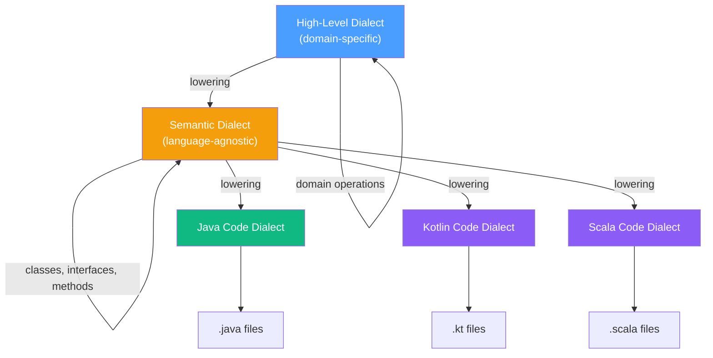

The critical piece is the **Semantic Dialect** — it captures OOP concepts without any language-specific details. This layer is shared. Adding a new target language means writing a new Code Dialect and an emission pass. The entire High-Level → Semantic pipeline stays untouched.

## Nanopass Pipeline

Instead of one monolithic transformation, IRCraft uses many small, single-purpose passes. Each is a pure function: immutable input → immutable output. Each can be tested in isolation and conditionally enabled.

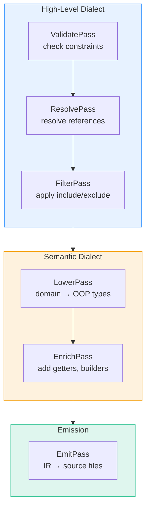

Passes compose into a Pipeline. The pipeline handles execution order, skips disabled passes, collects diagnostics, and supports fail-fast or collect-all error modes.

## Green-Red Trees

All IR nodes are GreenNodes — the "Green" part of [Red-Green Trees](https://ericlippert.com/2012/06/08/red-green-trees/) (Roslyn). The tree is split into two layers:

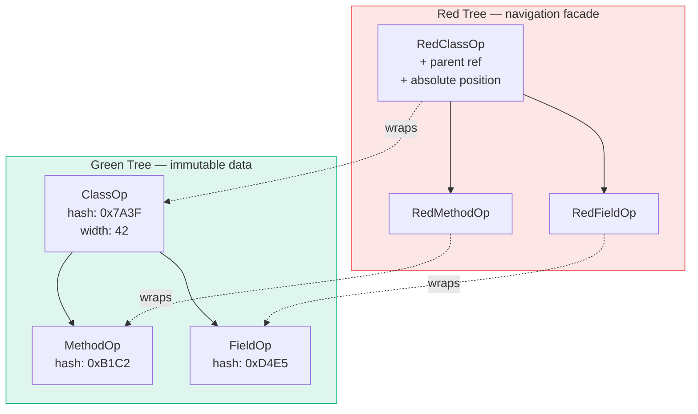

**Green tree** (implemented):
- Immutable (Scala 3 case classes)
- Content-addressable (`contentHash` derived from content, not identity)
- No parent references (top-down navigation only)
- Relative sizes (for future position computation)

**Red tree** (planned, Phase 9):
- Lightweight facade over green nodes
- Adds parent references and absolute positions
- Created lazily during traversal
- Thrown away entirely on any change

The insight: **most of the tree doesn't change between edits.** Two nodes with the same content produce the same `contentHash`. This gives:

- **Change detection.** Compare output hash to input hash. Same hash? Skip downstream passes.
- **Caching.** Store `contentHash → generated output`. Unchanged input = cache hit.
- **Structural sharing.** If a pass modifies 2 out of 20 fields, the unmodified 18 are shared between input and output trees.
- **Safe parallelism.** Immutable input means multiple passes can read concurrently.

## How They Work Together

The three concepts are complementary:

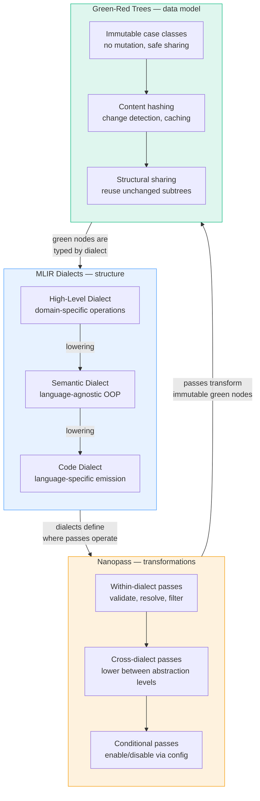

- **Dialects** define the abstraction levels (where)
- **Passes** define the transformations (how)
- **Green nodes** define the data model (what)

Each pass is a pure function: `GreenNode(v1) → GreenNode(v2)`. Input is never modified. This means no defensive copying, safe parallelism, and the ability to keep previous IR versions around for debugging.

---

## Module Dependency Graph

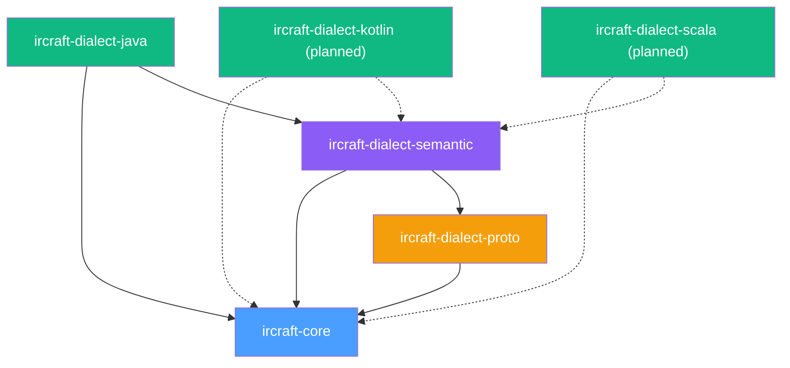

## Core Framework

ircraft-core provides the foundation — all other modules depend only on it.

### IR Nodes, Identity, and Types

**IR Nodes** are the tree structure. `GreenNode` is the base — immutable and content-addressable. `Operation` extends it with dialect membership (`kind`), typed metadata (`attributes`), and nested blocks (`regions`). `Module` is the root container that passes operate on.

**Identity & Metadata** support content-based equality. `ContentHash` computes deterministic hashes via MurmurHash3 mixing. `NodeId` is an opaque wrapper over the hash. `Attribute` is a sealed trait for typed key-value pairs attached to operations. `AttributeMap` is the immutable collection.

**Type System** is language-agnostic. `TypeRef` is a sealed trait with 10 variants covering primitives, collections, generics, unions, and named types. `Modifier` is an enum for access and declaration modifiers (public, abstract, final, etc.).

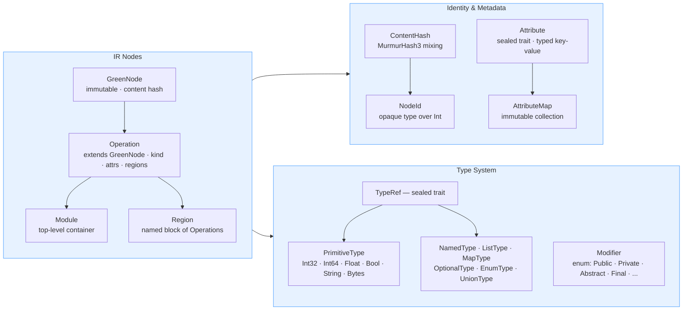

### Dialect, Pass Framework, and Emission

**Dialect & Pass Framework** is the transformation engine. A `Dialect` groups related operations and validates them. A `Pass` transforms a `Module` — stateless, pure function. A `Lowering` is a Pass that crosses dialect boundaries. `Pipeline` composes passes with execution order, conditional skipping, and diagnostics collection.

**Emission** converts IR to output. `Emitter` is a trait that takes a `Module` and returns a map of file paths to source code. `EmitterUtils` provides shared formatting utilities (indentation, block wrapping, doc comments) used by all language emitters.

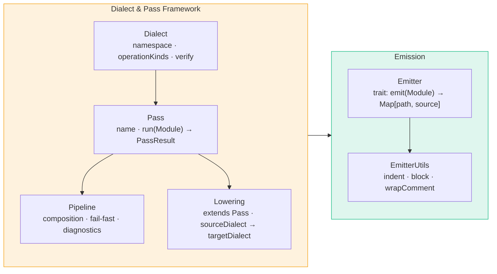

---

## Built-in Dialects

### Proto Dialect

High-level protobuf schema representation. Maps directly to proto-wrapper-plugin's `MergedSchema` model.

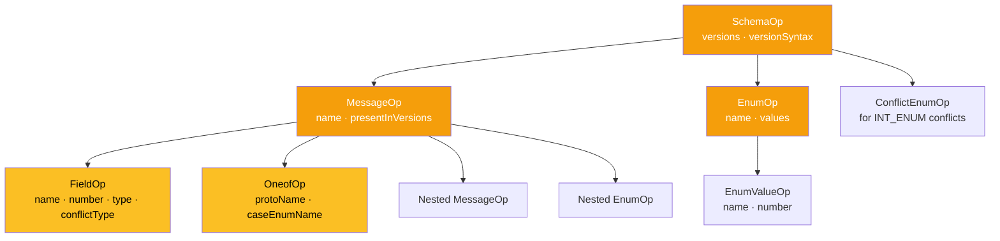

#### ConflictType

When a field changes type between proto versions, a ConflictType is assigned:

| ConflictType | Example | Resolution |
|---|---|---|
| `None` | Same type in all versions | Direct access |
| `IntEnum` | `int32` ↔ `enum` | Dual getters: int + enum helper |
| `Widening` | `int32` → `int64` | Wider type (long) |
| `FloatDouble` | `float` → `double` | Wider type (double) |
| `StringBytes` | `string` ↔ `bytes` | Manual conversion |
| `SignedUnsigned` | `int32` ↔ `uint32` | Long for safety |
| `RepeatedSingle` | singular ↔ repeated | List |
| `PrimitiveMessage` | `int32` ↔ `Money` | Dual accessors |
| `Incompatible` | Fundamentally different | Error |

#### Proto DSL

```scala
val schema = ProtoSchema.build("v1", "v2") { s =>
  s.message("Money") { m =>
    m.field("amount", 1, TypeRef.LONG)
    m.field("currency", 2, TypeRef.STRING)
  }
  s.enum_("Currency") { e =>
    e.value("USD", 0)
    e.value("EUR", 1)
  }
}
```

### Semantic Dialect

Language-agnostic OOP constructs. This is the shared layer — Java, Kotlin, and Scala dialects all lower from here.

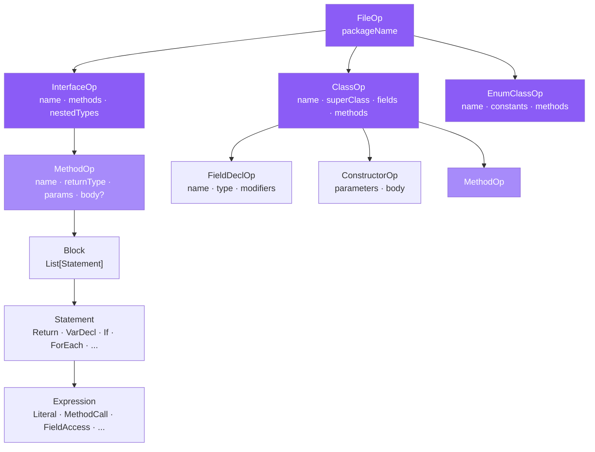

#### Proto → Semantic Lowering

The key transformation — encodes the generation strategy:

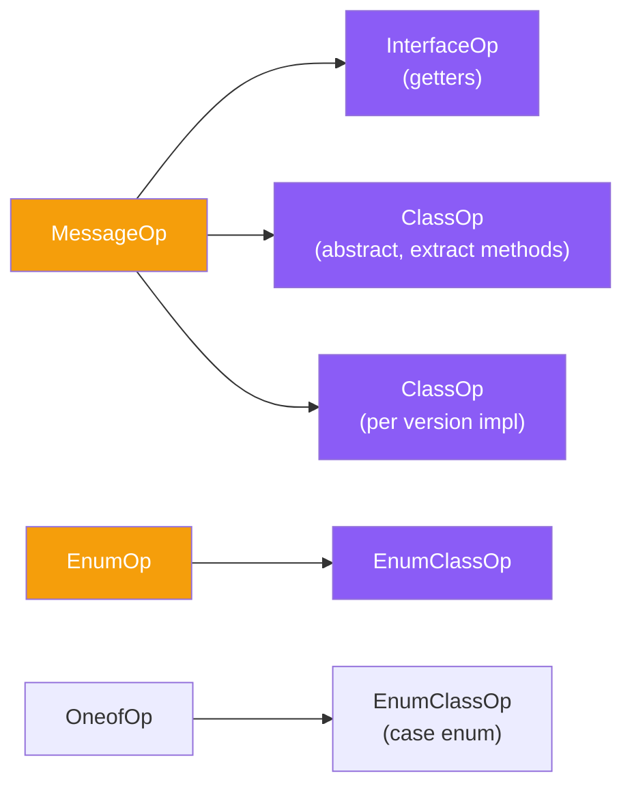

| Proto | → Semantic |
|-------|-----------|
| `MessageOp` | `InterfaceOp` + `ClassOp`(abstract) + `ClassOp`(impl per version) |
| `FieldOp` | `MethodOp`(getter) + `FieldDeclOp` + `MethodOp`(extract) |
| `EnumOp` | `EnumClassOp` |
| `OneofOp` | `EnumClassOp`(case enum) + `MethodOp`(discriminator) |

### Java Dialect

Emits Java source code from Semantic IR. No external dependencies (no JavaPoet).

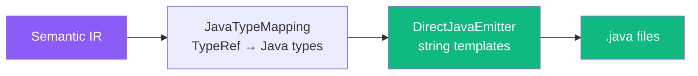

#### Type Mapping

| TypeRef | Java Type | Boxed |
|---------|-----------|-------|
| `Int32` | `int` | `Integer` |
| `Int64` | `long` | `Long` |
| `Float32` | `float` | `Float` |
| `Float64` | `double` | `Double` |
| `Bool` | `boolean` | `Boolean` |
| `StringType` | `String` | `String` |
| `Bytes` | `byte[]` | `byte[]` |
| `ListType(T)` | `List<T>` | — |
| `MapType(K,V)` | `Map<K,V>` | — |

---

## End-to-End Pipeline

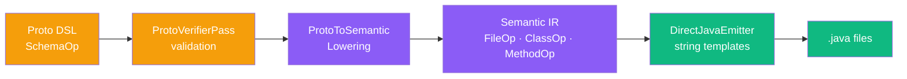

---

## Extending IRCraft

### Custom Dialect

```scala
object MyDialect extends Dialect:
  val namespace = "my"
  val description = "My custom dialect"

  object Kinds:
    val Widget = NodeKind(namespace, "widget")

  val operationKinds = Set(Kinds.Widget)

  def verify(op: Operation) =
    if !owns(op) then List(DiagnosticMessage.error("Not my op"))
    else Nil

case class WidgetOp(
    name: String,
    attributes: AttributeMap = AttributeMap.empty,
    span: Option[Span] = None,
) extends Operation:
  val kind = MyDialect.Kinds.Widget
  val regions = Vector.empty
  lazy val contentHash = ContentHash.ofString(name)
  val width = 1
```

### Custom Pass

```scala
object MyTransformPass extends Pass:
  val name = "my-transform"
  val description = "Transforms widgets"

  def run(module: Module, context: PassContext) =
    val transformed = module.topLevel.map:
      case w: WidgetOp => w.copy(name = w.name.toUpperCase)
      case other => other
    PassResult(module.copy(topLevel = transformed))
```

### Custom Pipeline

```scala
val pipeline = Pipeline("my-pipeline",
  MyTransformPass,
  ProtoVerifierPass,
  ProtoToSemanticLowering(config),
)
val result = pipeline.run(module, PassContext())
```

For a complete walkthrough, see [Creating a Custom Dialect](CUSTOM_DIALECT.md).
