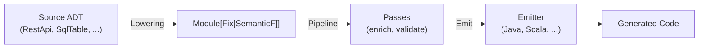
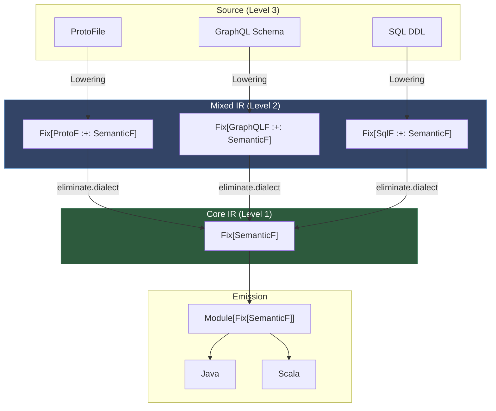
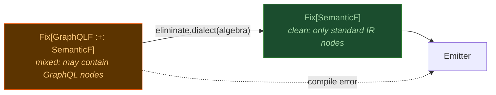
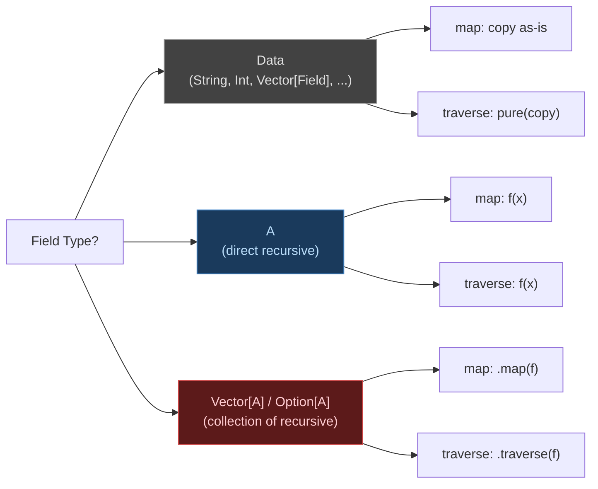

# Dialects Guide

## What is a Dialect

A dialect is your source schema -- the "A" in `A -> IR -> B`. It's just Scala case classes. ircraft doesn't require any base traits or registration.

## Creating a Source Dialect

### Step 1: Define your ADT

```scala
// Your domain -- no ircraft imports needed
case class RestApi(
  name: String,
  baseUrl: String,
  endpoints: Vector[Endpoint],
  models: Vector[Model],
)

case class Endpoint(
  path: String,
  method: String,       // GET, POST, ...
  requestBody: Option[String],  // model name
  responseType: String,         // model name
  description: String,
)

case class Model(
  name: String,
  fields: Vector[ModelField],
)

case class ModelField(
  name: String,
  fieldType: String,
  required: Boolean,
  description: String,
)
```

### Step 2: Write a Lowering

Lowering converts your ADT to ircraft IR. It's `Kleisli[F, Source, Module]`:

```scala
import cats.*
import io.alnovis.ircraft.core.*
import io.alnovis.ircraft.core.ir.*

val restLowering: Lowering[Id, RestApi] = Lowering.pure { api =>
  // Models -> TypeDecl
  val modelUnits = api.models.map { model =>
    CompilationUnit(
      namespace = s"com.example.${api.name.toLowerCase}.model",
      declarations = Vector(Decl.typeDecl(
        name = model.name,
        kind = TypeKind.Product,
        fields = model.fields.map { f =>
          val baseType = mapType(f.fieldType)
          val fieldType = if f.required then baseType else TypeExpr.Optional(baseType)
          Field(
            name = f.name,
            fieldType = fieldType,
            meta = Meta.empty.set(Doc.key, Doc(summary = f.description)),
          )
        }
      ))
    )
  }

  // Endpoints -> Protocol (service interface)
  val serviceUnit = CompilationUnit(
    namespace = s"com.example.${api.name.toLowerCase}.service",
    declarations = Vector(Decl.TypeDecl(
      name = s"${api.name}Service",
      kind = TypeKind.Protocol,
      functions = api.endpoints.map { ep =>
        val params = ep.requestBody.map(b =>
          Vector(Param("body", TypeExpr.Named(b)))
        ).getOrElse(Vector.empty)
        Func(
          name = endpointName(ep),
          params = params,
          returnType = TypeExpr.Named(ep.responseType),
          meta = Meta.empty.set(Doc.key, Doc(
            summary = ep.description,
            returns = Some(ep.responseType),
          )),
        )
      },
    ))
  )

  Module(api.name, modelUnits :+ serviceUnit)
}

def mapType(t: String): TypeExpr = t match
  case "string"  => TypeExpr.STR
  case "integer" => TypeExpr.INT
  case "long"    => TypeExpr.LONG
  case "boolean" => TypeExpr.BOOL
  case "double"  => TypeExpr.DOUBLE
  case other     => TypeExpr.Named(other)

def endpointName(ep: Endpoint): String =
  ep.method.toLowerCase + ep.path.split("/").filter(_.nonEmpty)
    .map(_.capitalize).mkString
```

### Step 3: Write domain-specific passes

```scala
// Add base URL as companion constant
val addBaseUrl = Pass.pure[Id]("add-base-url") { module =>
  // ... add ConstDecl with base URL to service type
  module
}

// Add HTTP annotations
val addHttpAnnotations = Pass.pure[Id]("http-annotations") { module =>
  // ... add @GET("/path"), @POST("/path") annotations to functions
  module
}
```

### Step 4: Compose and emit

```scala
val pipeline = Pipeline.of(addBaseUrl, addHttpAnnotations)
val module = restLowering(myApi)
val enriched = Pipeline.run(pipeline, module)
val files = ScalaEmitter.scala3[Id].apply(enriched)
```

## Lowering with Effects

### With Outcome (warnings)

```scala
val lowering: Lowering[Outcome[Id, *], RestApi] = Lowering { api =>
  val warnings = api.endpoints.filter(_.description.isEmpty).map(ep =>
    Diagnostic(Severity.Warning, s"Endpoint ${ep.path} has no description"))

  val module = buildModule(api)

  NonEmptyChain.fromSeq(warnings) match
    case Some(ws) => Outcome.warnAll(ws, module)
    case None     => Outcome.ok(module)
}
```

### With IO

```scala
val lowering: Lowering[IO, Path] = Lowering { path =>
  for
    content <- IO.blocking(Files.readString(path))
    schema  <- IO.fromEither(parseSchema(content))
  yield buildModule(schema)
}
```

## IR Reference

### Decl (declarations)

| Type | Use for |
|------|---------|
| `Decl.typeDecl(name, kind, fields, functions, nested, supertypes)` | Class, trait, struct |
| `Decl.enumDecl(name, variants, functions)` | Enumeration |
| `Decl.funcDecl(func)` | Top-level function |
| `Decl.constDecl(name, constType, value)` | Constant |
| `Decl.aliasDecl(name, target)` | Type alias |

### TypeKind

| Kind | Java | Scala | Rust |
|------|------|-------|------|
| `Product` | class | class | struct |
| `Protocol` | interface | trait | trait |
| `Abstract` | abstract class | abstract class | -- |
| `Sum` | sealed interface | sealed trait / enum | enum |
| `Singleton` | final class | object | -- |

### TypeExpr

```scala
TypeExpr.STR                          // String
TypeExpr.INT                          // Int / int
TypeExpr.LONG                         // Long / long
TypeExpr.BOOL                         // Boolean / boolean
TypeExpr.BYTES                        // Array[Byte] / byte[]
TypeExpr.VOID                         // Unit / void
TypeExpr.Primitive.Any                // Any / Object
TypeExpr.Named("com.example.Money")   // Named reference
TypeExpr.Local("Money")               // Same-package reference
TypeExpr.Imported("com.x.Money", "Money")  // Cross-package with import
TypeExpr.Unresolved("proto.FQN")      // Must be resolved before emission
TypeExpr.ListOf(TypeExpr.STR)         // List[String] / List<String>
TypeExpr.MapOf(TypeExpr.STR, TypeExpr.INT)  // Map[String, Int]
TypeExpr.Optional(TypeExpr.STR)       // Option[String] / String (nullable)
TypeExpr.SetOf(TypeExpr.INT)          // Set[Int]
TypeExpr.FuncType(Vector(TypeExpr.STR), TypeExpr.INT)  // String => Int
TypeExpr.Union(Vector(TypeExpr.STR, TypeExpr.INT))     // String | Int
```

### Expr (expressions)

```scala
Expr.Lit("42", TypeExpr.INT)          // literal
Expr.Ref("name")                      // variable reference
Expr.This / Expr.Super / Expr.Null    // keywords
Expr.Access(expr, "field")            // a.b
Expr.Call(Some(recv), "method", args) // recv.method(args)
Expr.New(typeExpr, args)              // new T(args) / T(args)
Expr.Cast(expr, typeExpr)             // (T) x / x.asInstanceOf[T]
Expr.BinOp(left, op, right)           // a + b, a == b
Expr.Lambda(params, body)             // (x) -> body / x => body
```

### Stmt (statements)

```scala
Stmt.Return(Some(expr))               // return x
Stmt.Let("x", TypeExpr.INT, Some(init))  // val x: Int = init
Stmt.Assign(target, value)            // x = value
Stmt.If(cond, thenBody, elseBody)     // if/else
Stmt.Match(expr, cases)               // match / if-chain
Stmt.ForEach(v, type, iter, body)     // for loop
Stmt.Throw(expr)                      // throw
Stmt.Comment("text")                  // inline comment
```

### Pattern (for Stmt.Match)

```scala
Pattern.TypeTest("x", TypeExpr.Named("Foo"))  // case x: Foo =>
Pattern.Literal(Expr.Lit("42", TypeExpr.INT)) // case 42 =>
Pattern.Binding("x")                           // case x =>
Pattern.Wildcard                                // case _ =>
```

## Meta: Extensible Metadata

Attach arbitrary typed data to any IR node via `Meta`:

```scala
// Define a key (identity-based, type-safe)
val sourceTable = Meta.Key[String]("source.table")

// Set in lowering
Field("id", TypeExpr.LONG, meta = Meta.empty.set(sourceTable, "users"))

// Read in pass
field.meta.get(sourceTable)  // Some("users")
```

### Doc (structured documentation)

```scala
val doc = Doc(
  summary = "User account.",
  description = Some("Represents a registered user in the system."),
  params = Vector("id" -> "unique identifier"),
  returns = Some("the user"),
  tags = Vector("since" -> "1.0"),
)

// Attach via Meta
Decl.typeDecl("User", TypeKind.Product, meta = Meta.empty.set(Doc.key, doc))

// Emitter renders as Javadoc / Scaladoc / rustdoc automatically
```

## Merge: Multi-Version Schemas

For schemas that evolve across versions (e.g., proto v1 + v2):

```scala
import io.alnovis.ircraft.core.merge.*

// Define conflict resolution strategy
val strategy = new MergeStrategy[Id]:
  def onConflict(conflict: Conflict): Outcome[Id, Resolution] =
    conflict.kind match
      case ConflictKind.FuncReturnType =>
        Outcome.warn(s"Type conflict in ${conflict.declName}", Resolution.UseType(conflict.versions.head._2))
      case _ =>
        Outcome.ok(Resolution.Skip)

// Merge N versioned modules
val merged: Outcome[Id, Module] = Merge.merge(
  NonEmptyVector.of(("v1", moduleV1), ("v2", moduleV2)),
  strategy
)
```

Merge detects conflicts (same field, different types) and delegates resolution to your strategy.

## Extensible Dialect Functors (FP-MLIR)

For advanced use cases where the standard IR (`SemanticF`) is not expressive enough, ircraft supports **open-world extensibility** via Data Types a la Carte. You define your dialect as a functor, mix it with `SemanticF` via a coproduct, and progressively lower it.

### When to Use This

- Your domain has constructs that don't map cleanly to `Decl` (e.g., GraphQL directives, SQL constraints, Terraform providers)
- You want **type-safe progressive lowering** -- the compiler guarantees your dialect is fully eliminated before emission
- You're building a reusable dialect that others can compose with their own

For simple schema-to-code scenarios, the standard Source Dialect approach (above) is sufficient.

### Architecture Overview

The standard Source Dialect approach lowers directly to `SemanticF`:



The Extensible Dialect Functor approach adds an intermediate level with **mixed IR** and **type-safe progressive lowering**:



Each `eliminate.dialect` step **shrinks the coproduct** -- the type system guarantees that no custom dialect operations survive past this point:



### Step 1: Define Your Dialect Functor

A dialect functor is an `enum` (or `sealed trait`) parameterized by `+A`, where `A` marks recursive children:

```scala
import io.alnovis.ircraft.core.algebra.{Fix, DialectInfo}

enum GraphQLF[+A]:
  case SchemaNodeF(queries: Vector[A], mutations: Vector[A])
  case DirectiveNodeF(name: String, args: Map[String, String], target: A)
  case FragmentNodeF(name: String, onType: String, selections: Vector[A])
```

### Step 2: Write Functor and Traverse Instances

Follow these **3 rules** for each field:



| Field type | `map` | `traverse` | `foldLeft` | `foldRight` |
|-----------|-------|-----------|-----------|------------|
| Data (`String`, `Int`, `Vector[Field]`, ...) | copy as-is | copy as-is + `pure` | `b` (skip) | `lb` (skip) |
| `A` (direct recursive) | `f(x)` | `f(x)` | `f(b, x)` | `f(x, lb)` |
| `Vector[A]` / `Option[A]` / `List[A]` | `.map(f)` | `.traverse(f)` | `.foldLeft(b)(f)` | `.foldRight(lb)(f)` |

For data-only cases (no `A` fields at all):
- `map`: return unchanged
- `traverse`: wrap in `Applicative[G].pure(...)`
- `foldLeft`: return `b`
- `foldRight`: return `lb`

Complete example:

```scala
import cats.{Applicative, Eval, Functor, Traverse}
import cats.syntax.all._

object GraphQLF:
  import GraphQLF._

  given Functor[GraphQLF] with
    def map[A, B](fa: GraphQLF[A])(f: A => B): GraphQLF[B] = fa match
      case SchemaNodeF(q, m)       => SchemaNodeF(q.map(f), m.map(f))
      case DirectiveNodeF(n, a, t) => DirectiveNodeF(n, a, f(t))
      case FragmentNodeF(n, o, s)  => FragmentNodeF(n, o, s.map(f))

  given Traverse[GraphQLF] with
    def traverse[G[_]: Applicative, A, B](fa: GraphQLF[A])(f: A => G[B]): G[GraphQLF[B]] = fa match
      case SchemaNodeF(q, m)       => (q.traverse(f), m.traverse(f)).mapN(SchemaNodeF(_, _))
      case DirectiveNodeF(n, a, t) => f(t).map(DirectiveNodeF(n, a, _))
      case FragmentNodeF(n, o, s)  => s.traverse(f).map(FragmentNodeF(n, o, _))

    def foldLeft[A, B](fa: GraphQLF[A], b: B)(f: (B, A) => B): B = fa match
      case SchemaNodeF(q, m)       => m.foldLeft(q.foldLeft(b)(f))(f)
      case DirectiveNodeF(_, _, t) => f(b, t)
      case FragmentNodeF(_, _, s)  => s.foldLeft(b)(f)

    def foldRight[A, B](fa: GraphQLF[A], lb: Eval[B])(f: (A, Eval[B]) => Eval[B]): Eval[B] = fa match
      case SchemaNodeF(q, m)       => q.foldRight(m.foldRight(lb)(f))(f)
      case DirectiveNodeF(_, _, t) => f(t, lb)
      case FragmentNodeF(_, _, s)  => s.foldRight(lb)(f)

  given DialectInfo[GraphQLF] = DialectInfo("GraphQLF", 3)
```

### Step 3: Define Lowering Algebra

The lowering algebra converts each operation of your dialect into a `SemanticF` subtree:

```scala
import io.alnovis.ircraft.core.algebra.Algebra.Algebra
import io.alnovis.ircraft.core.ir._
import io.alnovis.ircraft.core.ir.SemanticF._

val graphqlToSemantic: Algebra[GraphQLF, Fix[SemanticF]] = {
  case SchemaNodeF(queries, mutations) =>
    Fix[SemanticF](TypeDeclF("Schema", TypeKind.Product, nested = queries ++ mutations))
  case DirectiveNodeF(name, args, target) =>
    // Wrap target in a TypeDecl with directive metadata
    val meta = Meta.empty.set(Meta.Key[Map[String, String]]("directive.args"), args)
    Fix[SemanticF](TypeDeclF(s"@$name", TypeKind.Abstract, nested = Vector(target), meta = meta))
  case FragmentNodeF(name, onType, selections) =>
    Fix[SemanticF](TypeDeclF(name, TypeKind.Protocol,
      supertypes = Vector(TypeExpr.Named(onType)), nested = selections))
}
```

### Step 4: Build Mixed IR and Eliminate

```scala
import io.alnovis.ircraft.core.algebra._

// Define the mixed IR type
type GraphQLIR = GraphQLF :+: SemanticF

// Build your tree using Inject
val injGql = Inject[GraphQLF, GraphQLIR]
val injSem = Inject[SemanticF, GraphQLIR]

val tree: Fix[GraphQLIR] = Fix(injGql.inj(
  SchemaNodeF(
    queries = Vector(
      Fix(injSem.inj(TypeDeclF[Fix[GraphQLIR]]("User", TypeKind.Product,
        fields = Vector(Field("id", TypeExpr.LONG)))))
    ),
    mutations = Vector.empty
  )
))

// Eliminate GraphQLF, producing pure SemanticF
val clean: Fix[SemanticF] = eliminate.dialect(graphqlToSemantic).apply(tree)

// Now emit as usual
val module = Module("graphql", Vector(CompilationUnit("com.example", Vector(clean))))
val files = JavaEmitter[Id].apply(module)
```

**Type safety**: `eliminate.dialect` returns `Fix[SemanticF]`. Passing `Fix[GraphQLIR]` directly to the emitter won't compile -- the compiler forces you to eliminate all custom dialect operations first.

### Recursion Schemes

Use `scheme.cata` for generic bottom-up traversal on any dialect:

```scala
// Count all nodes in any dialect tree
def countNodes[F[_]: Traverse]: Fix[F] => Int =
  scheme.cata[F, Int] { fa =>
    Traverse[F].foldLeft(fa, 1)((acc, child) => acc + child)
  }
```

`scheme.cata` is stack-safe (trampolined via `cats.Eval`) and works with any `Traverse[F]` -- your dialect, `SemanticF`, or a coproduct of both.

### Generic Passes via Trait Mixins

Trait mixins (`HasName`, `HasFields`, `HasMethods`, `HasNested`, `HasMeta`, `HasVisibility`) let you write passes that work on **any dialect** without knowing its concrete type.

Provide instances for your dialect:

```scala
// In your dialect companion object:
given HasName[GraphQLF] with
  def name[A](fa: GraphQLF[A]): String = fa match
    case SchemaNodeF(_, _)       => "schema"
    case DirectiveNodeF(n, _, _) => n
    case FragmentNodeF(n, _, _)  => n

given HasNested[GraphQLF] with
  def nested[A](fa: GraphQLF[A]): Vector[A] = fa match
    case SchemaNodeF(q, m)       => q ++ m
    case DirectiveNodeF(_, _, t) => Vector(t)
    case FragmentNodeF(_, _, s)  => s
```

Then write generic passes using trait constraints:

```scala
import io.alnovis.ircraft.core.algebra._

// Collects all names from any dialect tree
def collectAllNames[F[_]: Traverse: HasName]: Fix[F] => Vector[String] =
  scheme.cata[F, Vector[String]] { fa =>
    Vector(HasName[F].name(fa)) ++ Traverse[F].foldLeft(fa, Vector.empty[String])(_ ++ _)
  }

// Validates that no node has an empty name
def validateNoEmptyNames[F[_]: Traverse: HasName]: Fix[F] => Vector[Diagnostic] =
  scheme.cata[F, Vector[Diagnostic]] { fa =>
    val name = HasName[F].name(fa)
    val childDiags = Traverse[F].foldLeft(fa, Vector.empty[Diagnostic])(_ ++ _)
    if (name.trim.isEmpty)
      childDiags :+ Diagnostic(Severity.Error, "Empty name found in dialect node")
    else childDiags
  }
```

These passes work **unchanged** on `Fix[SemanticF]`, `Fix[GraphQLF]`, or `Fix[GraphQLF :+: SemanticF]`:

```scala
// Same function, three different tree types:
val namesA: Vector[String] = collectAllNames[SemanticF].apply(semanticTree)
val namesB: Vector[String] = collectAllNames[GraphQLF].apply(graphqlTree)
val namesC: Vector[String] = collectAllNames[GraphQLF :+: SemanticF].apply(mixedTree)
```

Coproduct instances are auto-derived -- if both `F` and `G` have `HasName`, then `F :+: G` automatically has `HasName`.
